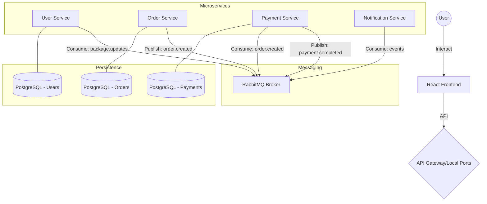

# Distributed Parcel Delivery & Tracking System
## Technical Report & Project Documentation

**Date**: December 19, 2025  
**Version**: 1.0.0  
**Status**: Completed  

---

## 1. Executive Summary
The **Distributed Parcel Delivery & Tracking System** is a robust, microservices-based platform designed to handle the complexities of modern logistics. By leveraging a distributed architecture, the system provides high scalability, real-time event processing, and reliable data management. It enables customers to request shipments, couriers to manage deliveries, and administrators to oversee the entire operation. The system uses **RabbitMQ** for asynchronous communication between services, ensuring that components remain decoupled and resilient.

---

## 2. Team Members & Roles

Our diverse team collaborated to build this system from the ground up, covering all aspects from backend logic to deployment.

| Name | Role | Primary Responsibilities |
|------|------|-------------------------|
| **Liya Tsegaye** | Project Lead | System architecture, team coordination, and requirement analysis. |
| **Maedot Amha** | Backend Developer | core logic implementation for User and Order services. |
| **Marsilas Wondimagegnehu** | Integration Engineer | Event-driven architecture setup and RabbitMQ integration. |
| **Meklit Habtamu** | Testing / QA Engineer | Database schema design, unit testing, and system validation. |
| **Meklit Melkamu** | DevOps / Deployment | Docker containerization, orchestration, and environment configuration. |
| **Melat Mekonnen** | Frontend Developer | UI/UX design and React application development. |

---

## 3. Problem Statement & Objectives

### 3.1 Problem Statement
Traditional monolithic delivery systems often face challenges such as:
*   **Scalability Bottlenecks**: Difficult to scale individual components (e.g., just the notification system) without scaling the whole app.
*   **Tight Coupling**: A failure in one module (like payments) could bring down the entire system.
*   **Lack of Real-Time Updates**: Processing high-frequency package status changes synchronously often leads to performance degradation.

### 3.2 System Objectives
*   **Distributed Architecture**: Implement independent microservices for User, Order, Payment, and Notification management.
*   **Event-Driven Communication**: Use a Pub/Sub model to handle cross-service interactions asynchronously.
*   **Role-Based Access**: Provide specialized interfaces for Customers, Couriers, and Managers/Admins.
*   **Containerization**: Ensure easy deployment and environment parity using Docker.
*   **Security & Reliability**: Implement JWT authentication, audit trails, and data persistence.

---

## 4. System Architecture

The project follows a **Microservices Architecture** pattern, where each service is responsible for a specific business domain.

### 4.1 High-Level Overview
The system consists of four primary microservices and a central message broker:
1.  **User Service**: Manages identity, authentication, and profiles.
2.  **Order Service**: Handles the lifecycle of a parcel delivery request.
3.  **Payment Service**: Processes transactions and manages payment status.
4.  **Notification Service**: A background worker that listens for events and sends alerts.
5.  **RabbitMQ**: The central nervous system that facilitates asynchronous event-driven communication.

### 4.2 Event-Driven Flow
Instead of services calling each other directly (which leads to coupling), they communicate via events:
*   **Order Created**: The Order Service publishes `order.created`. The Payment Service and Notification Service listen to this.
*   **Payment Completed**: Once payment is processed, Payment Service publishes `payment.completed`.
*   **Status Updated**: When a courier updates a package status, the Notification Service alerts the customer.

### 4.3 Architecture Diagram (Conceptual)


---

## 5. Technology Stack

The system utilizes a modern, robust tech stack to ensure performance and maintainability.

### 5.1 Frontend
*   **React (Vite)**: For a fast, responsive single-page application.
*   **Tailwind CSS**: For modern, clean UI styling.
*   **Axios**: For API communication.
*   **Lucide React**: For elegant iconography.

### 5.2 Backend (Microservices)
*   **Node.js & Express**: The foundation for our REST APIs.
*   **TypeScript**: Used across all services for type safety and better developer experience.
*   **Prisma ORM**: For database modeling and migrations.
*   **JWT (JSON Web Tokens)**: For secure, stateless authentication.

### 5.3 Infrastructure & Messaging
*   **Docker & Docker Compose**: For containerization and easy orchestration of all 7+ containers.
*   **RabbitMQ**: Our chosen message broker for Pub/Sub and Work Queues.
*   **PostgreSQL**: A reliable relational database, with separate instances for each service to ensure data isolation.

---

## 6. Service Deep Dive

### 6.1 User Service
The gateway to the system. It handles registration, login, and profile management for all user roles.
*   **Roles**: CUSTOMER, COURIER, MANAGER, ADMIN.
*   **Key Features**: JWT-based auth, password hashing with bcrypt, role-based access control (RBAC).
*   **Entities**: Users, Customer Profiles, Courier Profiles, Vehicles, Addresses.

### 6.2 Order Service
Manages the core business logic of parcel delivery.
*   **Workflow**: Order Creation ➝ Assignment ➝ Pickup ➝ In-Transit ➝ Delivered.
*   **Key Features**: Price calculation, real-time status tracking, automated event emission.
*   **Entities**: Orders, Tracking History.

### 6.3 Payment Service
Ensures financial transactions are handled securely and reported back to the order system.
*   **Workflow**: Listens for `order.created` ➝ Generates payment record ➝ Processes payment (mock) ➝ Updates order status.
*   **Key Features**: Transaction idempotency, payment verification logic.

### 6.4 Notification Service
A lean, reactive service focusing on user engagement.
*   **Mechanism**: Consumes events from RabbitMQ and "sends" (logs/simulates) emails and SMS to relevant parties.

---

## 7. Database Design

Each service owns its own database, adhering to the database-per-service pattern.

### 7.1 User Database Schema
The User Management database is the most complex, supporting multiple entities:
*   `users`: Core identity information.
*   `courier_profiles`: Specialized data for delivery staff (ID number, hire date, status).
*   `vehicles`: Details of vehicles assigned to couriers (type, license plate, capacity).
*   `addresses`: Multiple addresses (Home, Work, Billing) with specific local details (Subcity, Kebele).

### 7.2 Order Database Schema
Designed for performance and auditability:
*   `orders`: Contains pickup/dropoff coordinates, addresses, status, and associated user IDs.
*   `order_events`: An audit log of every status change (Created, Paid, Picked Up, etc.).

---

## 8. API Documentation

The system provides a comprehensive set of RESTful endpoints.

### 8.1 Authentication (User Service)
| Endpoint | Method | Description |
|----------|--------|-------------|
| `/api/auth/register` | `POST` | Create a new user account. |
| `/api/auth/login` | `POST` | Authenticate and retrieve JWT tokens. |
| `/api/auth/logout` | `POST` | Invalidate current session. |

### 8.2 Orders & Tracking (Order Service)
| Endpoint | Method | Description |
|----------|--------|-------------|
| `/api/orders` | `POST` | Create a new delivery request. |
| `/api/orders/my-orders`| `GET` | List orders for the authenticated user. |
| `/api/orders/:id` | `GET` | Get details and status of a specific order. |
| `/api/orders/:id/status`| `PATCH`| Update order status (Courier/Admin). |

### 8.3 Payments (Payment Service)
| Endpoint | Method | Description |
|----------|--------|-------------|
| `/api/payments/pay` | `POST` | Initiate payment for an order. |
| `/api/payments/:orderId`| `GET` | Get payment status and details. |

---

## 9. Event-Driven Messaging Schema

Events are the glue that holds the services together.

### 9.1 `order.created`
*   **Source**: Order Service
*   **Consumers**: Payment Service, Notification Service
*   **Payload**: `{ orderId, customerId, amount, items, timestamp }`

### 9.2 `payment.completed`
*   **Source**: Payment Service
*   **Consumers**: Order Service, Notification Service
*   **Payload**: `{ paymentId, orderId, status, transactionRef }`

---

## 10. Installation & Setup Guide

### 10.1 Prerequisites
*   **Docker Desktop**: Required for containerized deployment.
*   **Node.js (v18+)**: Required for local development.
*   **PostgreSQL**: Required if running services natively.

### 10.2 Recommended Setup (Docker Compose)
The easiest way to run the entire ecosystem:
1.  **Clone the Repository**:
    ```bash
    git clone https://github.com/meklithab/distributed-parcel-delivery-system
    cd distributed-parcel-delivery-system
    ```
2.  **Environment Variables**: Create a `.env` file in the root using `.env.template`.
3.  **Start Services**:
    ```bash
    docker-compose up --build
    ```
4.  **Access the App**:
    *   Frontend: `http://localhost:5173`
    *   User Service: `http://localhost:3001`
    *   Order Service: `http://localhost:3002`
    *   Payment Service: `http://localhost:3003`

---

## 11. User Manual

### 11.1 For Customers
1.  **Register/Login**: Create a customer account to access the dashboard.
2.  **Request Shipment**: Fill in pickup/dropoff addresses and package details.
3.  **Pay**: Once the order is created, click "Pay Now" to simulate payment.
4.  **Track**: View the status of your packages in real-time.

### 11.2 For Couriers
1.  **Assigned Tasks**: View packages assigned for pickup.
2.  **Update Status**: Update status as you move from "Picked Up" to "Delivered".

---

## 12. Security & Reliability

The system is built with security as a priority:
*   **JWT Authentication**: All sensitive routes are protected by stateless JWT authentication.
*   **Audit Trails**: Every status change in the Order system is logged with a timestamp and the actor responsible, ensuring a clear chain of custody.
*   **Data Isolation**: Each microservice has its own database, preventing "blast radius" issues where a leak in one service affects all data.
*   **Error Handling**: Centralized error handling and logging (using Morgan) provide visibility into system health.
*   **Container Security**: Services run as non-root users within Docker containers where possible, and environmental secrets are managed via `.env`.

---

## 13. Conclusion & Future Work

### 13.1 Achievements
We successfully designed and implemented a distributed system that:
*   Scales horizontally by service.
*   Handles asynchronous events reliably.
*   Provides a clean, intuitive user interface.
*   Manages complex data relationships for a logistics domain.

### 13.2 Future scope
*   **Real-time Maps**: Integration with Google Maps API for live courier movement.
*   **Mobile App**: Deployment to iOS and Android using Flutter or React Native.
*   **AI Routing**: Implementing machine learning algorithms to optimize delivery routes.

---

## 14. CI/CD Pipeline

The system incorporates a modern **CI/CD (Continuous Integration / Continuous Deployment)** pipeline using **GitHub Actions**. This ensures that every code change is automatically validated before being merged or deployed.

### 14.1 Automated Validation
The CI pipeline triggers on every push to `main` and `meklit-branch`. It performs the following checks:
*   **Multi-Service Validation**: Uses a build matrix to simultaneously test all four microservices and the frontend.
*   **Dependency Management**: Ensures all `npm` dependencies are correctly resolved.
*   **Compilation Check**: Runs `npm run build` to verify that TypeScript code compiles without errors.
*   **Docker Integrity**: Executes `docker-compose build` to ensure the containerization layer is consistent and ready for deployment.

### 14.2 Benefits
*   **Early Bug Detection**: Catches syntax and type errors before they reach production.
*   **Consistency**: Guarantees that the system can always be built from scratch using the provided Docker configuration.
*   **Rapid Feedback**: Provides developers with immediate results on their changes via the GitHub UI.

---
